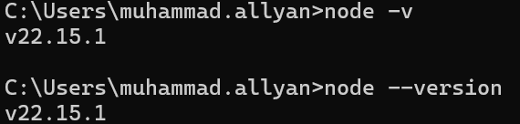

# **`Node.js & npm setup`** 🚀

## (A) Install _`nodejs`_ in your system. 👇

- Install the LTS (Long Term Support) version of node.js from this link => [Download Node.js](https://nodejs.org/en/download)
- Now set up the node.js in your system.
- After the successful installation you can check you version of node in your system. Open the cmd (Command Prompt) and type 👇
- `node -v` OR `node --version` you will get the version of node.js
- ```See the version``` </br></br>

## (B) Setup the _`npm`_ in our project. 👇

- We we need to add node package manager in our project. Make our project capable to use npm.
The command for adding npm in our project => `npm install`. Many people use this command `npm init -y` the issue in this command is it will skip alot of files. We don't want to skip any of the file. So do this command instead `npm init`

- After doing the above command it will ask some question before it can configure npm in our project, Just see below.
### Questions 👇
* `package name:` You can give any name you want.
* `version:` Keep it as default.
* `description:` You can write anything.
* `entry point:` index.html
* `test command:` jest (it's up to you but i am using jest right now)
* `git repository:` (https://github.com/Muhammad-Allyan/react-progress.git)
* `keywords:` You can give any keyword if you wish to.
* `author:` Muhammad Allyan (You can write any name it's up to you)
* `license:` (ISC) 

It will ask you now `Is it OK?` hit enter and it will install the `package.json` file. 

### `package.json`

- package.json is the configuration for our npm. Whatever we gave the above like package name, vesion, description or anything this file contains all the information.

- As you know our project is dependent on alot of packages. Those `package` that our project is dependent on are the `dependencies` and `npm` manages that, So `npm` take cares that what is the version of our package and it will take care of it inside the `package.json` file.

***So finally we configure npm in our project and now we can get package and dependencies into our project.***

## (C) Let's install the _`bundler`_ in our project. 👇


- The Most important package or dependency is the bundler we are using in our project.

### So what is bundler? ###

- A bundler is a tool that automates the process of combining multiple files, like JavaScript, CSS, and images, into a smaller number of optimized files (bundles) for efficient delivery to web browsers.

**In an easy way let suppose!**
- When we have the normal HTML, CSS & JAVASCRIPT files and alot of things in our code. So before sending it to the production our whole code need to be `bundled`, `compressed`, `minified`, `cached`, `cleaned`. The job of a bundler is to bundle your app package your app for making our app ready to deploy to the production. So a bundler helps you to do all that things.
  
- `Webpack`, `Parcel`, `Vite` and many more these are bundlers.

- So in our app we are using parcel as a bundler.

- Parcel basically comes as a node package so we are going to install that package.

7- When we will install any package/dependencies in our app we have the same command for all.

8- Command => npm install parcel but we will give the parameter a flag which is => npm install -D parcel.

9- What is -D above in the command?

10- The -D is represents the dependency. There are two types of dependencies.

10(a)- The developer dependency/packages => It is generally required for in a development face. When we are developing our app so the we required the dev dependency/package.

10(b)- The normal dependency/packages => The normal dependency/package are used in production also.

So we are telling npm the package manager that we are installing the package as a dev dependency.

So after writing this command => npm install -D parcel. Then it will install the parcel and fetch the package the parcel from the npm package manager repository.

So after the installaion is complete then we got the package-lock.json and node-modules in our project and what is these two files? Also parcel has been added in our package.json file as a dev dependeny.

11- "parcel": "^2.15.4" => The caret sign ?

12- "parcel": "~2.15.4" => The tilde sign ?

13- package-lock.json =>

14- "integrity": "sha512 ?

15- node-modules =>

16- Reinstalling the node-modules command => npm install

17- gitignore file ?

17(a)- node-modules file

17(b)- dist file

17(c)- parcel-cache file

18- Important files to push ?

### (B) _`IGNITING`_ OUR APP / _`BUILDING`_ OUR APP 👇

#### We will use parcel to ignite/build our app and how? See the command below 🚀

1- The command => npx parcel index.html

2- npx parcel ?

3- npx parcel build index.html ?

4- "main": App.js => Entry point of our app ?

4- npm install react =>

5- npm install react-dom =>

6- npm i = npm install

### (C) What _`Parcel`_ is doing for us ? 👇

[Parcel Doc](https://parceljs.org/)

- Dev Build
- Local Server
- HMR => Hot Module Replacment
- File Watching Algorithm => written in C++
- Caching => Faster Builds
- Image Optimisation
- Minification
- Bundling => The core job of parcel beacuse it is a bundler
- Compressing
- Content Hashing
- Code Splitting
- Differential Bundling => Your app can be opened inside internet explorer or older versions. So parcel take cares of all that to support older browsers
- Diagnostics
- Error Handling
- HTTPs Features
- Tree Shaking => remove unused code
- Different dev & production bundle

### (D) Making our app compatible for _`older`_ versions ? 👇

#### browserslist 📂

1- What is browserslist?

- [Check Browsers Versions](https://browserslist.dev/)
- [Npm JS Browsers List](https://www.npmjs.com/package/browserslist)

##### The command below is for last 2 version of all browsers

```package.json
"browserslist": [
"last 2 versions"
]
```

## [_`Components`_](https://github.com/Muhammad-Allyan/react-progress/blob/e9c2022334a02e13bf7c8a79ea1c8f524223c09d/master%20react/Components.md)
