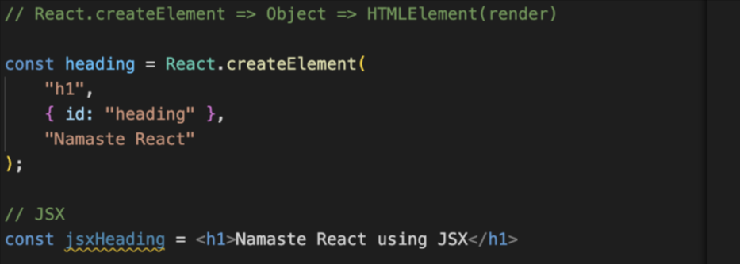
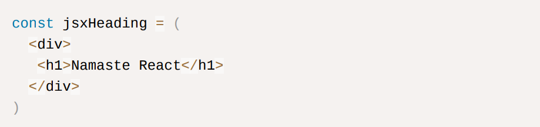
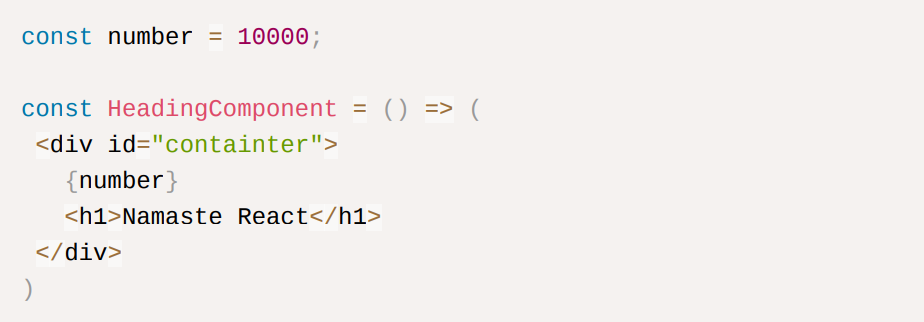
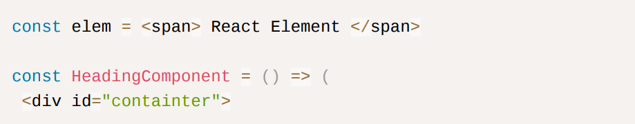
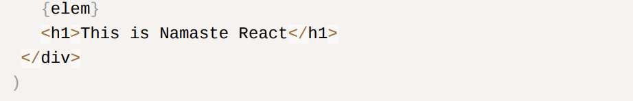

## Q ) What is JSX?

JSX is HTML-like or XML-like syntax. JSX stands for JavaScript XML. It's a syntax extension for JavaScript.

- It is not a part of React. React apps can be built even without JSX but the code will become very hard to read.
- It is not HTML inside JavaScript.
- JavaScript engine cannot understand JSX as it only understands ECMAScript

`See the code below.`    

- When we log heading and jsxHeading, it gives the same object. From this point, we will not be using React.createElement()

## Q ) Is JSX a valid JavaScript?

**The answer is yes and no.**

- JSX is not a valid Javascript syntax as it’s not pure HTML or pure JavaScript for a browser to understand. JS does not have built-in JSX. The JS engine does not understand JSX because the JS engine understands ECMAScript or ES6+ code

## Q ) If the browser can’t understand JSX how is it still working?

**This is because of Parcel because “Parcel is a Beast”.**

- Before the code gets to JS Engine it is sent to Parcel and Transpiled there. Then after transpilation, the browser gets the code that it can understand.

**Transpilation ⇒** Converting the code in such a format that the browsers can understand.

- Parcel is like a manager who gives the responsibility of transpilation to a package called Babel.
- Babel is a package that is a compiler/transpiler of JavaScript that is already present inside ‘node-modules’. It takes JSX and converts it into the code that browsers understand, as soon as we write it and save the file. It is not created by Facebook.

**Learn more about Babel on [babeljs.io](https://babeljs.io/)**

**_JSX (transpiled by Babel) ⇒ React.createElement ⇒ ReactElement ⇒ JS Object ⇒ HTML Element(render)_**

## Q ) What is the difference between HTML and JSX?

**JSX is not HTML. It’s HTML-like syntax.**

- HTML uses ‘class’ property whereas JSX uses ‘className’ property
- HTML can use hypens in property names whereas JSX uses camelCase syntax.

## Single Line and Multi Line JSX Code

Single line code:

Multi-line code:

- If writing JSX in multiple lines then using ‘()’ parenthesis is mandatory. To tell Babel from where JSX is starting and ending.

## Q ) How to use JavaScript code inside JSX?

Inside a React Component when ‘{}’ parenthesis is present we can write any JavaScript expression inside it.

`See the code below:`

## Q ) How to call React Element in JSX?

We can use ‘{}’ parenthesis.

## Advantages of using JSX.

1. Sanitizes the data

   - If someone gets access to your JS code and sends some malicious data which will then get displayed on the screen, that attack is called cross-site scripting.
   - It can read cookies, local storage, session storage, get cookies, get info about your device, and read data. JSx takes care of your data.
   - If some API passes some malicious data JSX will escape it. It prevents cross-site scripting and sanitizes the data before rendering.

2. Makes code readable
   - JSX makes it easier to write code as we are no longer creating elements using React.createElement()

3) Makes code simple and elegant
4) Show more useful errors and warnings
5) JSX prevents code injections (attacks)
